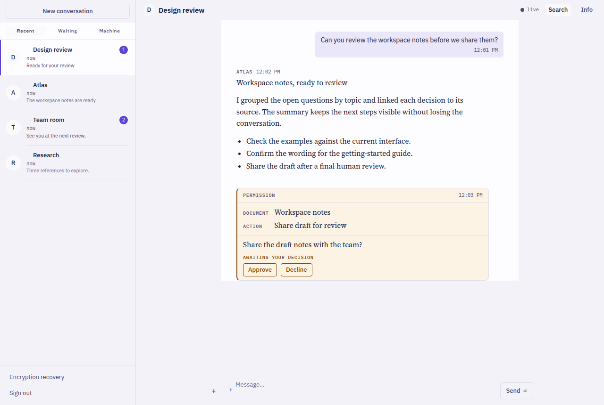

# supermessage

[](https://github.com/SuperJackfruitLabs/supermessage/actions/workflows/ci.yml)
[](https://github.com/SuperJackfruitLabs/supermessage/releases/latest)
[](LICENSE)

A cross-platform, agent-aware Matrix chat client for iOS, Android, Windows,
macOS, and Linux. The platforms share a Rust Matrix core: desktop uses
**Tauri 2 + Svelte 5**, iOS uses **SwiftUI**, and Android uses **Kotlin/Compose**
through UniFFI. See [AGENTS.md](AGENTS.md) for the current architecture and
[docs/tech-stack.md](docs/tech-stack.md) for the original decisions.

**[Download desktop](https://github.com/SuperJackfruitLabs/supermessage/releases/latest)** ·
**[Build from source](#building)** ·
**[Development guide](AGENTS.md)** ·
**[Issues](https://github.com/SuperJackfruitLabs/supermessage/issues)**



*Desktop frontend captured in Chromium with synthetic local fixtures. It shows
production UI components; no Matrix account or live conversation was used.
Native window chrome and platform rendering differ.*

## Status: early, with active desktop and native clients

The table describes implemented source paths on this branch, reviewed in
September 2026. It is not a promise that every platform has a current signed
release, or that every operation has been exercised against a live homeserver.

| Capability | Desktop (Linux/macOS/Windows) | iOS | Android |
|---|---|---|---|
| Password login, persistent session, room and timeline sync | Implemented | Implemented | Implemented |
| Messages, replies, reactions, typing and read receipts | Implemented | Implemented | Implemented |
| File/image sending and editing/deleting own messages | Implemented | Implemented | Implemented |
| New conversations, room joining and accepting invitations | Implemented | Implemented | Implemented |
| Message search | Homeserver search | Homeserver search | Homeserver search |
| Encryption and key recovery | SDK crypto and recovery UI | SDK crypto and recovery UI | SDK crypto and recovery UI |
| AgentPod turn/permission cards and Superpipeline gates | Implemented; gate sender uses shared core | Implemented | Implemented |
| Background push notifications when closed | Not implemented | Not implemented | Not implemented |

Search depends on homeserver support and is not an encrypted local-history
search. Encrypted events can still show undecryptable placeholders when keys
are unavailable; recovery support does not establish full cross-client E2EE
parity. Platform-specific account and room settings differ.

The implementation paths are the desktop [routes](src/routes/+page.svelte),
[composer](src/lib/components/Composer.svelte) and [timeline](src/lib/components/Timeline.svelte),
the [iOS app](apple/Supermessage) and [Android app](android/app/src/main/kotlin/dev/supermessage),
and the shared [Rust core](crates/supermessage-core/src). Frontend and Rust
regression tests cover contracts; they do not establish live delivery,
background execution or complete device/platform validation. Windows, macOS
and mobile need their own build and device checks.

[docs/parity-gap-analysis.md](docs/parity-gap-analysis.md) is a dated August
assessment with a drift note. Use it for comparison context, not as today's
capability list.

## What it is for

supermessage is built for rooms whose occupants include both people and AI
agents:

- **Agent-aware rendering.** Production renderers handle AgentPod turns,
  permission requests and Superpipeline gates, with plain-text fallback for
  clients that do not recognize those event schemas.
- **Approvals from chat.** Gate choices use the shared core's structured
  Matrix decision sender, carrying the gate identifier and the gate event
  reference. AgentPod permission replies remain ordinary chat text. Resolving
  a Superpipeline gate also requires the AgentPod Application Service and its
  human-identity mapping; local tests do not prove that live integration.
- **A reading surface for long-form agent output.** Message bodies are set for
  reading and surrounding controls for scanning. See the
  [design language](docs/design-language.md).

Ordinary Matrix chat does not require suite services. Suite-specific decision
handling requires a compatible bridge on the receiving side.

## Installing

Choose an asset from the [latest published desktop release](https://github.com/SuperJackfruitLabs/supermessage/releases/latest):

| Platform | Download |
| --- | --- |
| Linux x86_64 | `.deb`, `.rpm` or `.AppImage` |
| macOS, Apple Silicon and Intel | Universal `.dmg` |
| Windows x64 | Setup `.exe` or `.msi` |

These formats are present in the published v0.0.11 release (August 30, 2026).
The source capability table above may include changes newer than a download.
Desktop binaries are **unsigned**; macOS Gatekeeper and Windows SmartScreen
can warn on first run. Native iOS and Android clients currently have build
instructions in [AGENTS.md](AGENTS.md), rather than a mobile store release
published by this repository's release workflow.

Use an existing Matrix account on a homeserver that supports password login.
Ordinary chat needs no AgentPod or Superpipeline installation.

## Building

Requires [Rust](https://rustup.rs), [Node](https://nodejs.org) 22+ and
[pnpm](https://pnpm.io) at the version pinned in `package.json`, plus the
[Tauri 2 platform prerequisites](https://v2.tauri.app/start/prerequisites/)
for your OS.

```sh
git clone https://github.com/SuperJackfruitLabs/supermessage.git
cd supermessage
pnpm install --frozen-lockfile
pnpm tauri dev             # run the app
pnpm test                  # frontend unit tests
pnpm check                 # svelte-check
pnpm build                 # frontend build
cargo test --workspace     # core, FFI and desktop shell
```

Use `pnpm tauri build` for a desktop bundle. `pnpm build` only builds the
frontend; a bare Cargo debug binary expects the Vite server to be running.
The [release workflow](.github/workflows/release.yml) creates draft desktop
releases on `v*` tags, which need publication before users can download them.

## Repository guide

| Area | Responsibility |
| --- | --- |
| [`crates/supermessage-core/`](crates/supermessage-core/) | Matrix sessions, sync, crypto and shared view models |
| [`crates/supermessage-ffi/`](crates/supermessage-ffi/) | UniFFI boundary for native mobile clients |
| [`src/`](src/) and [`src-tauri/`](src-tauri/) | Svelte desktop UI and Tauri host |
| [`apple/`](apple/) | Native SwiftUI app, state layer and previews |
| [`android/`](android/) | Native Compose app, state layer and FFI module |
| [`design/tokens.toml`](design/tokens.toml) | Shared design tokens generated into all clients |

## Documentation and contributing

Start with [AGENTS.md](AGENTS.md) for architecture, platform prerequisites,
mobile build commands and validation rules. Useful references:

- [Design language](docs/design-language.md) and [preview snapshots](docs/preview-snapshots.md)
  explain the shared visual system and its fixture-based checks.
- [AgentPod event schemas](docs/agentpod-events.md) document the suite cards.
- [CI workflow](.github/workflows/ci.yml) defines platform checks and selects
  jobs according to changed paths.
- [Technical decisions](docs/tech-stack.md) record the original design;
  compare dated plans with the current source before extending them.

For desktop changes, run the frontend checks above and the applicable Rust
checks (`cargo test --workspace`, `cargo fmt --all --check`, and
`cargo clippy --workspace --all-targets --all-features -- -D warnings`).
For visual or mobile changes, also follow the platform and snapshot checks in
the development guide. Inspect failed frames before updating a baseline, and
report local test results separately from device or live homeserver checks.

## Licence

[MIT](LICENSE).

Dependencies are held to a permissive-licence policy — permissive licences
plus unmodified MPL-2.0, with GPL, AGPL and LGPL refused. This is enforced in
CI by [`src-tauri/deny.toml`](src-tauri/deny.toml) rather than left to
review, because the case that matters is a transitive dependency changing
licence during a routine bump.
